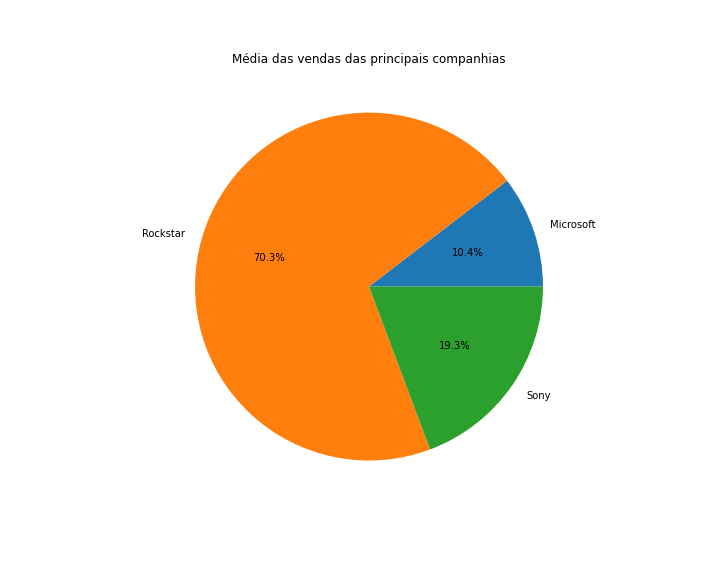

<p align="center">
  <a href="" rel="noopener">
  </a>
</p>

<h3 align="center">Game Analytics</h3>

---

<p align="center"> Projeto criado para a análise acerca dos jogos de console lançados nos últimos anos.
    <br>
</p>

## 📝 Sumário

- [Sobre](#sobre)
- [Iniciando](#inicio)
- [Preparando Uso](#preparando)
- [Como Usar](#como-usar)
- [Tecnologias Usadas](#tecnologias-usadas)
- [TODO](./TODO.md)
- [Contribuindo](./CONTRIBUTING.md)
- [Desenvolvedores](#desenvolvedores)

## 🧐 Sobre <a name = "sobre"></a>
O objetivo desse projeto é realizar uma análise sobre os jogos de ação para _console_ das principais produtoras (Sony, CD Projekt Red, Microsoft e Rockstar). Para a obtenção desses dados, utilizaram-se as bases do Metacritic e VG Sales através do Web Scraper do repositório (link). Após isso, realizou-se a limpeza dos dados coletados, além da junção dos jogos obtidos pelas duas bases, formando um _dataset_ único. Por fim, a análise foi feita, obtendo alguns gráficos.


## 🏁 Iniciando <a name = "inicio"></a>

Essas serão as instruções de como reproduzir uma cópia do seu projeto para desenvolvê-lo ou testá-lo. Veja "[Preparando Uso](#preparando)" para instruções de como preparar o sistema desenvolvido para uso.

### Pré-requisitos

Anaconda

Pode ser instalado através do [site](https://www.anaconda.com/products/distribution).

Jupyter Notebook

Instalado por meio do Anaconda Navigator, o qual é instalado automaticamente com o Anaconda.

### Instalando

Um passo a passo com exemplos de como deixar tudo pronto para o desenvolvimento.

Verificando se o Anaconda foi instalado.
Abra o Anaconda Prompt (Windows) ou terminal e execute:

```
conda --version
```

Caso o comando não seja reconhecido, significa que a instalação não ocorreu com sucesso.


## 🚀 Preparando Uso <a name = "preparando"></a>

Se a instalação foi realizada com sucesso, para instalar as dependências, abra o Anaconda Prompt.

No diretório do projeto, execute:

```
conda install --file requirements.txt
```

## 🎈 Como Usar <a name="como-usar"></a>

Ainda no Anaconda Prompt, no diretório do projeto, execute:

```
jupyter notebook
```

## ⛏️ Tecnologias Usadas <a name = "tecnologias-usadas"></a>

- [Python](https://www.python.com/) - Linguagem
- [Jupyter Notebook](https://jupyter.org/) - 
- [Anaconda](https://anaconda.com/) - Gerenciador de pacotes

## ✍️ Desenvolvedores <a name = "desenvolvedores"></a>

- [@fernandanlisboa](https://github.com/fernandanlisboa) - Trabalho
